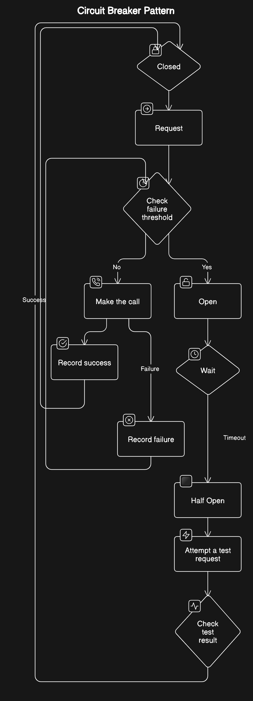
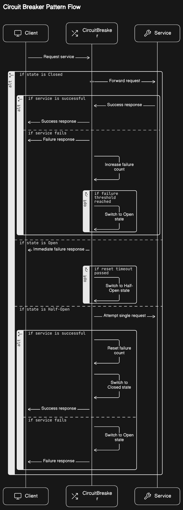
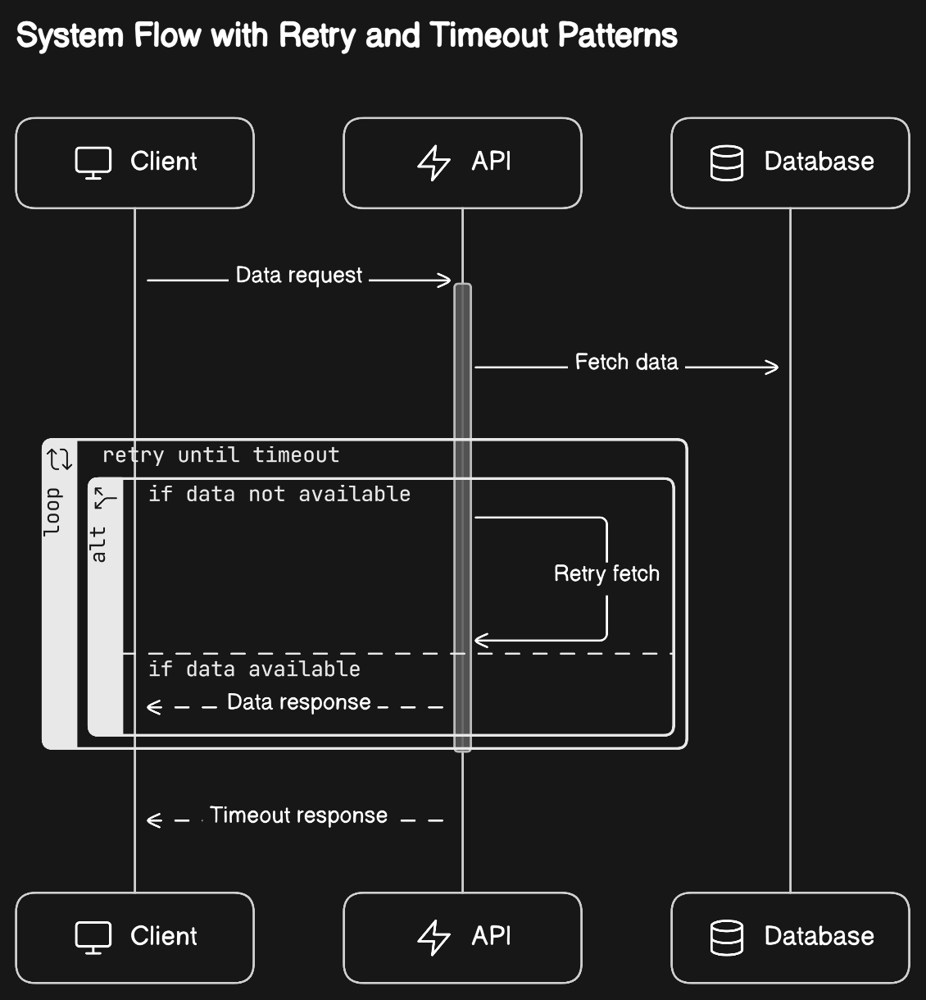

# Reliability Patterns

## Introduction

This document describes the reliability patterns that are used in the design of the system

## Patterns

### Circuit Breaker

The circuit breaker pattern is used to prevent a service from repeatedly trying to execute an operation that is likely to fail. If the operation is likely to fail, the circuit breaker opens and the operation is not attempted until the circuit breaker closes again. This pattern is used to prevent the system from becoming overwhelmed by repeated failures.

 
 

### Retry

The retry pattern is used to automatically retry an operation that has failed. This pattern is used to improve the reliability of the system by automatically retrying operations that have failed due to transient faults.

 

### Timeout

The timeout pattern is used to set a time limit on an operation. If the operation takes longer than the specified time limit, the operation is cancelled. This pattern is used to prevent the system from becoming overwhelmed by long-running operations.

